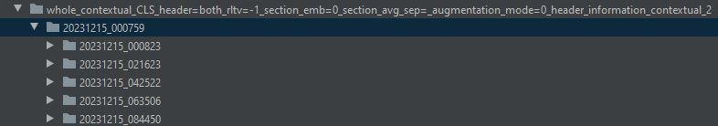
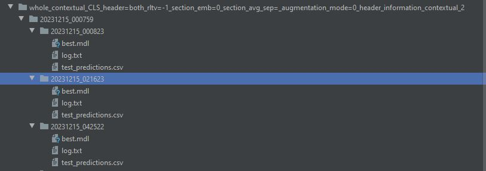

This directory contains code for various finetuning methods and experiments performed on the CONSORT-TM dataset. 

Before running the code, please install the required packages using the following command: 

```
conda env create -n <env_nam> -f environment.yml \\ replace <env_nam> with your preference
```

To run the setting that creates the best-performing PubMedBERT model, use the following command:

```
bash scripts/run_experiments_best.sh
```

To run all other experiments (i.e., finetune multiple PubMedBERT models under different configurations), use the following command:

```
bash scripts/run_experiments_other_settings.sh
```

As a note, the above script will take a significant amount of time to run. Individual experiments can be copied from this to be run separately.

After tuning a model to a specific setting, a folder that contains the best checkpoints for five folders of cross-validation will be shown in the directory. For example, after finetuning a PubMedBERT model using the setting "sentence content + Section headers (prepended to preceding, current and trialing sentences) + Contextual information + sentence representation [CLS]", a folder "whole_contextual_CLS_header=both_rltv=-1_section_emb=0_section_avg_sep=_augmentation_mode=0_header_information_contextual_2/20231215_000759" is created. The last information ("20231215_000759") is the date and time when the experiment was run and will vary from our own data as a result. This directory contains checkpoints for five cross-validation folders, as the following figure shows:



To aggregate the testing results yielded by the best checkpoints of each cross-validation folders, you can use the following command:

```
python post_evaluate.py --path=<path_to_the_checkpoints_fodler> --section=<test_on_the_data_from_which_section>
```

For example, to aggregate the results yielded by the setting "sentence content + Section headers (prepended to preceding, current and trialing sentences) + Contextual information + sentence representation [CLS]" on the whole test set, you can run the following command:

```
python post_evaluate.py --path="whole_contextual_CLS_header=both_rltv=-1_sect
ion_emb=0_section_avg_sep=_augmentation_mode=0_header_information_contextual_2/20231215_222340" --section="Whole"
```

You can download the checkpoints in "whole_contextual_CLS_header=both_rltv=-1_sect
ion_emb=0_section_avg_sep=_augmentation_mode=0_header_information_contextual_2/20231215_222340" from this [link](https://drive.google.com/drive/folders/1zpB7Zxq9AyiLYMmOqZdM1tueX3nH4dRM?usp=sharing). The checkpoints were created under the PubMedBERT setting that yielded the best performance.

To get the prediction results, precision, recall, F1 score and the micro AUC scores for each cross-validation folder as well as the aggregated results, you can run the following command (use the model trained with the best PubMedBERT setting, which has been put into the link, as an example):
```
python test.py --target="[CLS]" --section_header="both" --bert_model_name="microsoft/BiomedNLP-PubMedBERT-base-uncased-abstract-fulltext" --augmentation_mode=0 --augmentation_file="" --sent_dim=0 --rltv=-1 --section_emb=0 --position_emb=0 --section_dim=0 --train_file="data/all_CONSORT_manual_data.csv" --test_file="" --mode="contextual" --save=1 --section_avg_sep="" --section="whole" --checkpoint="2023
1215_000759" --test_on_specific_section="Whole" --header_information_contextual=2
```

After running the code, the prediction results (test_predictions.csv) will be created as the following figure shows:


The performance will be shown as follows:


- micro_auc_all:  [0.9514433969433327, 0.9524967036188811, 0.9559935904931169, 0.9516409071693085, 0.9627810509001948]
- micro_precision_all:  [0.6873212583412774, 0.7076446280991735, 0.7225186766275347, 0.7333333333333333, 0.738747553816047]
- macro_precision_all:  [0.6534248980527328, 0.7232231915146493, 0.6429941398550876, 0.695580784850996, 0.6722654307662157]
- micro_recall_all:  [0.6959459459459459, 0.6618357487922706, 0.7232905982905983, 0.7340748230535895, 0.7129367327667611]
- macro_recall_all:  [0.6582642592010707, 0.6196122992296923, 0.6193732039591213, 0.6901793527273435, 0.6066010543192729]
- micro_f1_all:  [0.6916067146282974, 0.6839740389415876, 0.7229044313934864, 0.7337038908539667, 0.7256126862085537]
- macro_f1_all:  [0.6469817124085565, 0.6518688926559231, 0.6152720048372702, 0.6869241244976139, 0.6290014402022684]
- micro precision: (0.7179130900434731, 0.020822894186384434)
- macro precision: (0.6774976890079362, 0.03246224972789442)
- micro recall: (0.705616769769833, 0.0282228165711245)
- macro recall:(0.6388060338873002, 0.03464475234109579)
- micro F1:(0.7115603524051783, 0.02222411336527222)
- macro F1: (0.6460096349203265, 0.02712633353365054)
- micro auc: (0.9548711298249668, 0.004786657505216749)

If you hope to test the model performance on a specific criteria, for example, "Results", you can set the criteria information in "--test_on_specific_section" parameter as following:

```
python test.py --target="[CLS]" --section_header="both" --bert_model_name="microsoft/BiomedNLP-PubMedBERT-base-uncased-abstract-fulltext" --augmentation_mode=0 --augmentation_file="" --sent_dim=0 --rltv=-1 --section_emb=0 --position_emb=0 --section_dim=0 --train_file="data/all_CONSORT_manual_data.csv" --test_file="" --mode="contextual" --save=1 --section_avg_sep="" --section="whole" --checkpoint="2023
1215_000759" --test_on_specific_section="Results" --header_information_contextual=2
```
After running "python test.py ...", you will find that the files "test_predictions.csv" which contains the prediction outcomes of each cross-validation folder are listed. Based on these files, we can get the document-level performances. To calculate the document-level performance of the model, you can specific the model path in the "path" and "section" parameters in document_level_performance.py, then run the following code: 

```
python document_level_performance.py
```
